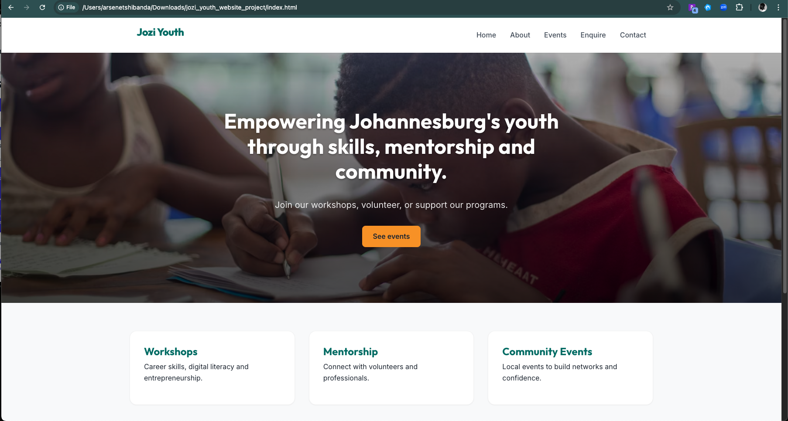

# Jozi Youth — Website Project

## Overview
Jozi Youth is a youth outreach website built as part of the Web Project PoE.

## How to run
1. Open `index.html` in your browser (or run a local static server: `python -m http.server`).

## Images & Credits
Images are hotlinked from Unsplash using the Source API (https://source.unsplash.com). Suggested attributions and search pages are included in `images/credits.txt`.

## References (Harvard style examples)
- Unsplash. (2025). *Unsplash* [online]. Available at: https://unsplash.com (Accessed: 14 October 2025).
- Mozilla Developer Network. (2025). *Using the srcset attribute* [online]. Available at: https://developer.mozilla.org (Accessed: 14 October 2025).
- W3C. (2025). *HTML5 specification* [online]. Available at: https://www.w3.org (Accessed: 14 October 2025).

## Changelog
- 2025-10-14: Initial commit — HTML pages and folder structure.
- 2025-10-14: Added CSS and responsive styles; integrated Unsplash source images.
- 2025-10-14: Added JS interactions and form validation; prepared SEO files.
- 2025-11-19: Implemented responsive images using HTML5 `picture` element and updated hero styles.
- 2025-11-19: Added FAQ Accordion (About), Leaflet Map (Contact), Event Search and Lightbox (Services) for Part 3.

## Screenshots
### Desktop

### Tablet

### Mobile

